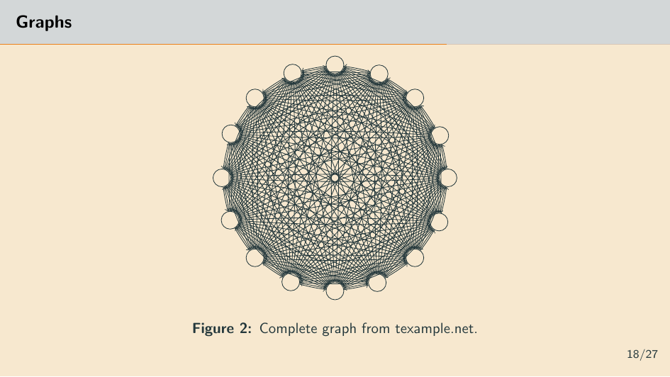

# Beamer Template

I used to use [Metropolis](https://github.com/matze/mtheme) theme in my beamer presentations. It is a simple and modern Beamer theme. It tries to minimize noise and maximize space for content.

### Features

- The color palette somehow inspired by [gruvbox](https://github.com/morhetz/gruvbox)
- Syntax highlighting (e.g. Solidity).
- Progressbar
- Appendix and Backup slides
- Bibliography
- Custom footer
- Standout frame
- Different block environments
- Page title logo

### Screenshots

|                      |                      |
|----------------------|----------------------|
|    |  |
|  |  |
